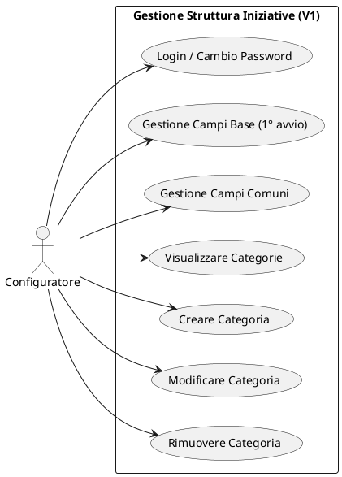
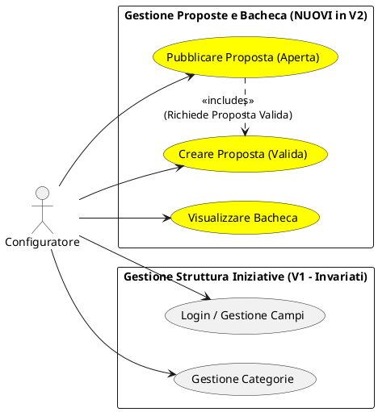

# Casi d'Uso: Versione 1 vs Versione 2

---
## Versione 1

### Attori
- **Configuratore**: Utente responsabile dell'impostazione del sistema.

### Casi d'Uso Testuali (V1)
1. **Effettuare Login/Registrazione**: Il configuratore inserisce le credenziali predefinite per accedere per la prima volta e imposta le proprie credenziali personali, oppure esegue il login con credenziali già impostate.
2. **Impostare Campi Base**: Al primissimo avvio, il configuratore definisce i campi obbligatori di sistema.
3. **Gestire Campi Comuni**: Il configuratore può aggiungere, modificare (cambiarne l'obbligatorietà) o rimuovere campi condivisi da tutte le categorie.
4. **Gestire Categorie**:
   - *Creare Categoria*: Il configuratore crea una nuova categoria, specificandone nome e descrizione, e definendone eventuali campi specifici.
   - *Modificare Categoria*: Il configuratore aggiunge o rimuove campi specifici a una categoria esistente.
   - *Rimuovere Categoria*: Il configuratore elimina una categoria e i suoi campi dal sistema.
5. **Visualizzare Categorie**: Il configuratore vede l'albero delle categorie e i rispettivi campi (base, comuni, specifici).

### Diagramma UML Casi d'Uso (PlantUML) - V1

---
## Versione 2

### Attori
- **Configuratore**

### Casi d'Uso Testuali (V2)
*(I casi d'uso da 1 a 5 rimangono invariati rispetto alla V1).*

**NUOVI CASI D'USO IN V2:**
6. **<mark>Creare Proposta</mark>**: Il configuratore seleziona una categoria e compila un modulo per proporre un nuovo evento. Il sistema verifica la congruenza logica delle date e la compilazione dei campi obbligatori, assegnando lo stato `VALIDA`.
7. **<mark>Pubblicare Proposta in Bacheca</mark>**: Il configuratore sceglie di rendere pubblica una proposta valida, facendola passare allo stato `APERTA` nella bacheca di sistema.
8. **<mark>Visualizzare Bacheca</mark>**: Il configuratore può vedere tutte le proposte attualmente aperte, raggruppate per categoria d'appartenenza.

### Diagramma UML Casi d'Uso (PlantUML) - V2
*(I nuovi casi d'uso sono evidenziati col colore giallo per risaltare)*

