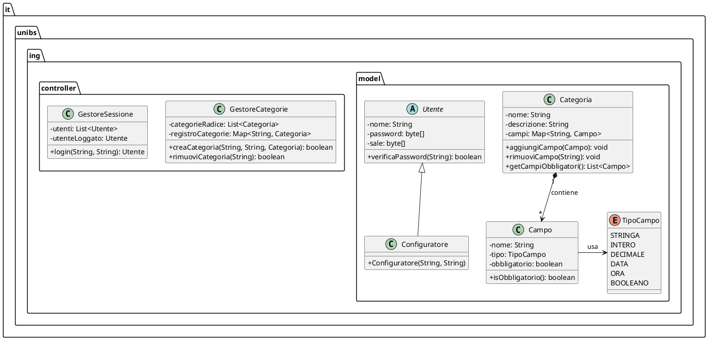
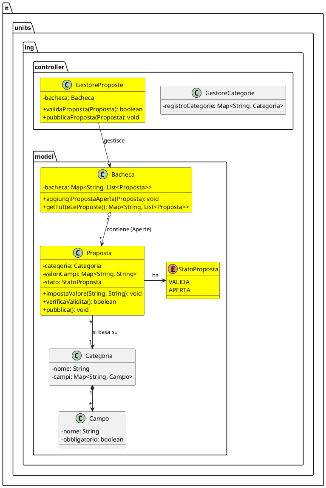

# Diagramma delle Classi: Versione 1 vs Versione 2

---
## Versione 1 - UML Class Diagram

---
## Versione 2 - UML Class Diagram

*(Le nuove classi introdotte in V2, ovvero `Proposta`, `StatoProposta`, `Bacheca` e `GestoreProposte`, sono evidenziate con il colore di riempimento giallo acceso `#Yellow`)*

