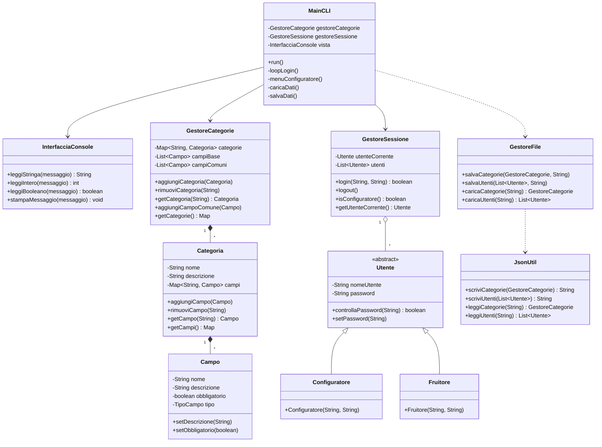

# Diagramma delle Classi - Versione 1

```mermaid
classDiagram
    class MainCLI {
        -GestoreCategorie gestoreCategorie
        -GestoreSessione gestoreSessione
        -InterfacciaConsole vista
        +run()
        -loopLogin()
        -menuConfiguratore()
        -caricaDati()
        -salvaDati()
    }

    class InterfacciaConsole {
        +leggiStringa(messaggio) String
        +leggiIntero(messaggio) int
        +leggiBooleano(messaggio) boolean
        +stampaMessaggio(messaggio) void
    }

    class GestoreCategorie {
        -Map~String, Categoria~ categorie
        -List~Campo~ campiBase
        -List~Campo~ campiComuni
        +aggiungiCategoria(Categoria)
        +rimuoviCategoria(String)
        +getCategoria(String) Categoria
        +aggiungiCampoComune(Campo)
        +getCategorie() Map
    }

    class GestoreSessione {
        -Utente utenteCorrente
        -List~Utente~ utenti
        +login(String, String) boolean
        +logout()
        +isConfiguratore() boolean
        +getUtenteCorrente() Utente
    }

    class Categoria {
        -String nome
        -String descrizione
        -Map~String, Campo~ campi
        +aggiungiCampo(Campo)
        +rimuoviCampo(String)
        +getCampo(String) Campo
        +getCampi() Map
    }

    class Campo {
        -String nome
        -String descrizione
        -boolean obbligatorio
        -TipoCampo tipo
        +setDescrizione(String)
        +setObbligatorio(boolean)
    }

    class Utente {
        <<abstract>>
        -String nomeUtente
        -String password
        +controllaPassword(String) boolean
        +setPassword(String)
    }

    class Configuratore {
        +Configuratore(String, String)
    }

    class Fruitore {
        +Fruitore(String, String)
    }

    class GestoreFile {
        +salvaCategorie(GestoreCategorie, String)
        +salvaUtenti(List~Utente~, String)
        +caricaCategorie(String) GestoreCategorie
        +caricaUtenti(String) List~Utente~
    }

    class JsonUtil {
        +scriviCategorie(GestoreCategorie) String
        +scriviUtenti(List~Utente~) String
        +leggiCategorie(String) GestoreCategorie
        +leggiUtenti(String) List~Utente~
    }

    MainCLI --> GestoreCategorie
    MainCLI --> GestoreSessione
    MainCLI --> InterfacciaConsole
    MainCLI ..> GestoreFile
    GestoreFile ..> JsonUtil
    GestoreCategorie "1" *-- "*" Categoria
    Categoria "1" *-- "*" Campo
    GestoreSessione "1" o-- "*" Utente
    Utente <|-- Configuratore
    Utente <|-- Fruitore
```
